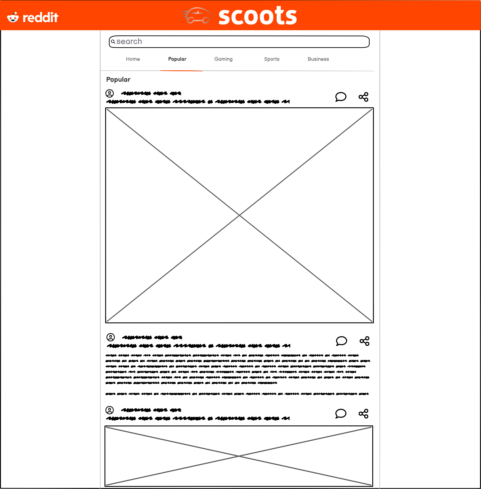

<!-- Improved compatibility of back to top link: See: https://github.com/othneildrew/Best-README-Template/pull/73 -->

<!--
*** Thanks for checking out the Best-README-Template. If you have a suggestion
*** that would make this better, please fork the repo and create a pull request
*** or simply open an issue with the tag "enhancement".
*** Don't forget to give the project a star!
*** Thanks again! Now go create something AMAZING! :D
-->

<!-- PROJECT SHIELDS -->
<!--
*** I'm using markdown "reference style" links for readability.
*** Reference links are enclosed in brackets [ ] instead of parentheses ( ).
*** See the bottom of this document for the declaration of the reference variables
*** for contributors-url, forks-url, etc. This is an optional, concise syntax you may use.
*** https://www.markdownguide.org/basic-syntax/#reference-style-links
-->
[![Contributors][contributors-shield]][contributors-url]
[![Forks][forks-shield]][forks-url]
[![Stargazers][stars-shield]][stars-url]
[![Issues][issues-shield]][issues-url]
[![MIT License][license-shield]][license-url]

<!-- PROJECT LOGO -->
 

  

<h3 align="center">scoots</h3>

  

    Codecademy Portfolio Project: Build Your Own Reddit App
     
    <a href="https://github.com/BrianFugate/scoots"><strong>Explore the docs »</strong></a>
     
     
    <a href="https://github.com/BrianFugate/scoots">View Demo</a>
    ·
    <a href="https://github.com/BrianFugate/scoots/issues">Report Bug</a>
    ·
    <a href="https://github.com/BrianFugate/scoots/issues">Request Feature</a>
  

<!-- TABLE OF CONTENTS -->

  <h2>Table of Contents</h2>
  <ol>
    <li>
      <a href="#about-the-project">About The Project</a>
      <ul>
        <li><a href="#overview">Overview</a></li>
        <li><a href="#objectives">Objectives</a></li>
        <li><a href="#background">Background</a></li>
        <li><a href="#wireframes">Wireframes</a></li>
        <li><a href="#future-features">Future Features</a></li>
        <li><a href="#built-with">Built With</a></li>
      </ul>
    </li>
    <li><a href="#roadmap">Roadmap</a></li>
    <li><a href="#license">License</a></li>
    <li><a href="#contact">Contact</a></li>
    <li><a href="#acknowledgments">Acknowledgments</a></li>
  </ol>

<!-- ABOUT THE PROJECT -->
## About The Project

### Overview
#### Build Your Own Reddit App

For this project, you will build an application for [Reddit](https://www.reddit.com/) using everything you’ve learned, including React and Redux. Reddit is a website where people share links to articles, media and other things on the web. The Reddit API provides data which you will integrate into your application. The application will allow users to view and search posts and comments provided by the API.       

### Objectives

- Build the application using React and Redux
- Version control your application with Git and host the repository on GitHub
- Use a project management tool (GitHub Projects, Trello, etc.) to plan your work
- Write a README (using Markdown) that documents your project including:
    - Wireframes
    - Technologies used
    - Features
    - Future work
- Write unit tests for your components using Jest and Enzyme
- Write end-to-end tests for your application
- Users can use the application on any device (desktop to mobile)
- Users can use the application on any modern browser
- Users can access your application at a URL
- Users see an initial view of the data when first visiting the app
- Users can search the data using terms
- Users can filter the data based on categories that are predefined
- Users are shown a detailed view (modal or new page/route) when they select an item
- Users are delighted with a cohesive design system
- Users are delighted with animations and transitions
- Users are able to leave an error state
- Get 90+ scores on Lighthouse
    - We understand you cannot control how media assets like videos and images are sent to the client. It is okay to have a score below 90 for Performance if they are related to the media from Reddit.
- OPTIONAL: Get a custom domain name and use it for your application
- OPTIONAL: Set up a CI/CD workflow to automatically deploy your application when the master branch in the repository changes
- OPTIONAL: Make your application a progressive web app

### Background

This code is for a Codecademy project in the Full-Stack Engineer career path. More specifically, it is the final project in the Front-End Development section of said career path. 

### Wireframes

  
  

(<a href="#readme-top">back to top</a>)

### Future Features

After this project is successfully deployed and I learn the appropriate skills to tie in a back-end server, the following features may be added.

- User account creation and integration with a Reddit account to allow more interactions with Reddit such as:
    - Upvoting and downvoting
    - Leaving comments and replying to other comments
    - Saving posts
    - Joining subreddits
    - Viewing Reddit account details

### Built With

- [![JavaScript][JavaScript]][JavaScript-url]
- [![React][React.js]][React-url]
- [![Redux][Redux.js]][Redux-url]
- [![Git][Git]][Git-url]
- [![GitHub][GitHub.com]][GitHub-url]
- [![VS-Code][VS-Code]][VS-Code-url]
- [![Netlify][Netlify]][Netlify-url]
- [![Jest][Jest]][Jest-url]

(<a href="#readme-top">back to top</a>)

<!-- ROADMAP -->
## Roadmap

The project progress is being tracked on a Kanban board which can be viewed [here](https://github.com/users/BrianFugate/projects/1/views/1).

See the [open issues](https://github.com/BrianFugate/scoots/issues) for a full list of proposed features (and known issues).

Please, feel free to add an issue is you find something is not working properly.

(<a href="#readme-top">back to top</a>)

<!-- LICENSE -->
## License

Distributed under the MIT License. See `LICENSE.txt` for more information.

(<a href="#readme-top">back to top</a>)

<!-- CONTACT -->
## Contact

Brian Fugate - fugateb@yahoo.com

Project Link: [https://github.com/BrianFugate/scoots](https://github.com/BrianFugate/scoots)

(<a href="#readme-top">back to top</a>)

<!-- ACKNOWLEDGMENTS -->
## Acknowledgments

* [othneildrew / Best-README-Template](https://github.com/othneildrew/Best-README-Template)

(<a href="#readme-top">back to top</a>)

<!-- MARKDOWN LINKS & IMAGES -->
<!-- https://www.markdownguide.org/basic-syntax/#reference-style-links -->
[contributors-shield]: https://img.shields.io/github/contributors/BrianFugate/scoots.svg?style=for-the-badge
[contributors-url]: https://github.com/BrianFugate/scoots/graphs/contributors
[forks-shield]: https://img.shields.io/github/forks/BrianFugate/scoots.svg?style=for-the-badge
[forks-url]: https://github.com/BrianFugate/scoots/network/members
[stars-shield]: https://img.shields.io/github/stars/BrianFugate/scoots.svg?style=for-the-badge
[stars-url]: https://github.com/BrianFugate/scoots/stargazers
[issues-shield]: https://img.shields.io/github/issues/BrianFugate/scoots.svg?style=for-the-badge
[issues-url]: https://github.com/BrianFugate/scoots/issues
[license-shield]: https://img.shields.io/github/license/BrianFugate/scoots.svg?style=for-the-badge
[license-url]: https://github.com/BrianFugate/scoots/blob/master/LICENSE.txt
[linkedin-shield]: https://img.shields.io/badge/-LinkedIn-black.svg?style=for-the-badge&logo=linkedin&colorB=555
[linkedin-url]: https://linkedin.com/in/linkedin_username
[product-screenshot]: images/screenshot.png
[JavaScript]: https://img.shields.io/badge/JavaScript-grey?style=for-the-badge&logo=javascript
[JavaScript-url]: https://developer.mozilla.org/en-US/docs/Web/JavaScript
[React.js]: https://img.shields.io/badge/React-20232A?style=for-the-badge&logo=react&logoColor=61DAFB
[React-url]: https://reactjs.org/
[Redux.js]: https://img.shields.io/badge/Redux-764ABC?style=for-the-badge&logo=redux
[Redux-url]: https://redux.js.org/
[Git]: https://img.shields.io/badge/Git-grey?style=for-the-badge&logo=git 
[Git-url]: https://git-scm.com/
[GitHub.com]: https://img.shields.io/badge/GitHub-%23181717?style=for-the-badge&logo=github
[GitHub-url]: https://github.com/
[VS-Code]: https://img.shields.io/badge/VSCode-%23007ACC?style=for-the-badge&logo=visualstudiocode
[VS-Code-url]: https://code.visualstudio.com/
[Netlify]: https://img.shields.io/badge/Netlify-grey?style=for-the-badge&logo=netlify
[Netlify-url]: https://www.netlify.com/
[Jest]: https://img.shields.io/badge/Jest-%23C21325?style=for-the-badge&logo=jest
[Jest-url]: https://jestjs.io/